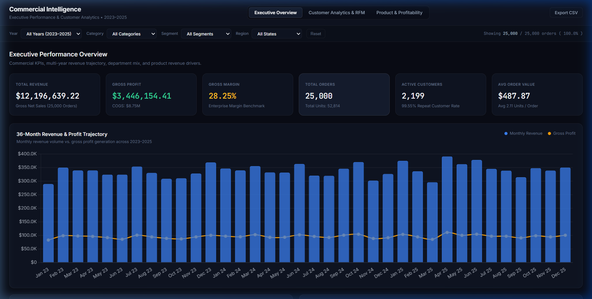
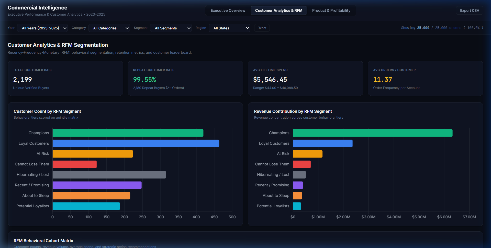
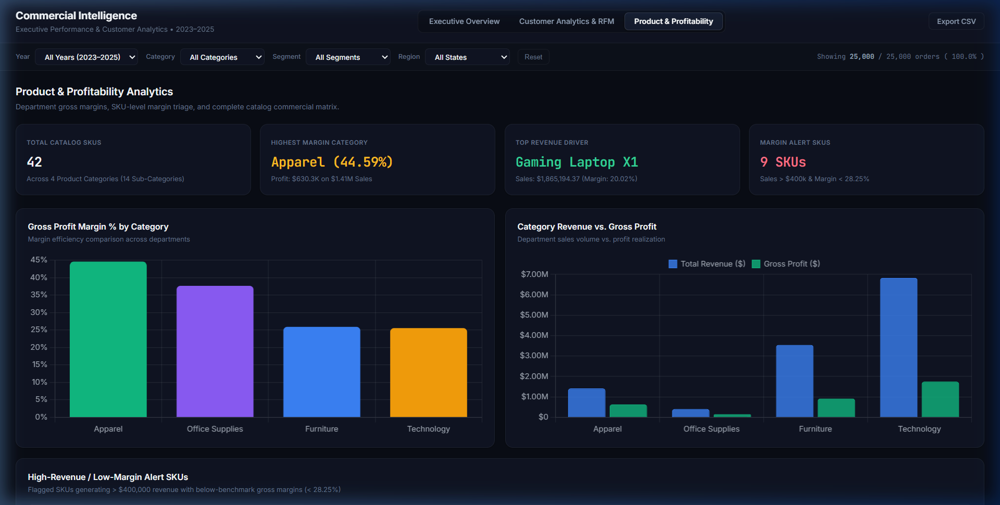

# E-Commerce Sales & Customer Analytics Dashboard

[](https://shivamkumxr.github.io/Ecommerce-Sales-Customer-Analytics/dashboard_web/)
[](https://www.python.org/)
[](https://pandas.pydata.org/)
[](https://numpy.org/)
[](https://www.mysql.com/)
[](https://developer.mozilla.org/en-US/docs/Web/JavaScript)
[](https://www.chartjs.org/)

An enterprise-grade, end-to-end Data Analytics portfolio project analyzing **25,000 transaction records** across 3 full calendar years (2023–2025). This project demonstrates complete data lifecycle competency: raw data ingestion and diagnostic hygiene in **Python**, indexed **MySQL 8+** data mart design with 20 production business queries, deterministic **RFM behavioral customer segmentation**, and an interactive, client-side **Web Analytics Dashboard** built with **HTML5, CSS3, JavaScript, and Chart.js**.

---

## 🌐 Dashboard Preview & Live Demo

> **🚀 Live Interactive Dashboard:** [https://shivamkumxr.github.io/Ecommerce-Sales-Customer-Analytics/dashboard_web/](https://shivamkumxr.github.io/Ecommerce-Sales-Customer-Analytics/dashboard_web/)  
> *(Zero backend required — runs 100% client-side with real-time multi-filtering on all 25,000 records)*

### 1. Executive Performance Overview
Macro financial KPIs, 36-month dual line/bar revenue and profit trajectory, department revenue distribution, customer segment split, and top 10 product revenue drivers.



---

### 2. Customer Analytics & RFM Segmentation
Deterministic quintile Recency-Frequency-Monetary (RFM) behavioral segmentation classifying 2,199 buyers into 8 strategic cohorts, customer count and revenue share distributions, and a searchable high-value customer leaderboard.



---

### 3. Product Merchandising & Profitability Analytics
Department gross margin comparison (Apparel 44.59% vs Technology 25.54%), High-Revenue / Low-Margin Alert Triage table (> $400k sales, < 28.25% margin), and a complete 42-SKU searchable merchandising matrix.



---

## 📌 Project Overview

Modern multi-category retail enterprises require continuous visibility into sales velocity, product gross margins, regional hub performance, and customer retention. This project delivers an end-to-end commercial intelligence system transforming raw transaction logs into executive decision-making tools.

### Key Headline Benchmarks (100% Verified from Dataset):
* **Total Revenue (Gross Net Sales):** **$12,196,639.22**
* **Total Gross Profit:** **$3,446,154.41**
* **Overall Gross Profit Margin:** **28.25%** (Total COGS: $8,750,484.81)
* **Total Completed Orders:** **25,000 transactions**
* **Total Units Sold:** **52,814 units**
* **Active Unique Customer Base:** **2,199 verified buyers**
* **Average Order Value (AOV):** **$487.87**
* **Repeat Customer Rate:** **99.55%** (2,189 repeat buyers)
* **Average Customer Lifetime Spend:** **$5,546.45** (Avg 11.37 orders/buyer)

---

## 🎯 Business Problem Addressed

Commercial leadership faced three critical analytical blind spots:
1. **Margin Leakage & Product Mix:** Lack of SKU-level visibility into whether high-volume revenue drivers were generating healthy margins or eroding overall profitability.
2. **Customer Revenue Concentration:** Uncertainty regarding how much revenue was driven by top-tier VIP accounts versus casual buyers.
3. **Customer Churn & Dormancy:** Inability to detect high-value accounts that had stopped ordering, resulting in missed re-engagement and cross-selling opportunities.

---

## 🛠️ Technology Stack

| Technology | Role & Purpose in Project |
|---|---|
| **Python 3.10+** | Core programming language for ETL pipeline, data transformations, and scripting |
| **Pandas** | Data cleaning, missing value imputation, constraint validation, feature engineering, and aggregations |
| **NumPy** | Vectorized mathematical calculations, precision alignment, and numerical filtering |
| **MySQL 8.0+ / SQL** | Relational schema DDL, B-tree indexing, Common Table Expressions (CTEs), and Window Functions (`LAG`, `SUM OVER`, `DENSE_RANK`) |
| **HTML5 & CSS3** | Clean, minimal enterprise dark-themed dashboard structure, CSS Grid/Flexbox layouts, and custom UI components |
| **JavaScript (ES6+)** | Client-side reactive multi-filter engine, dynamic DOM rendering, search filtering, and CSV export logic |
| **Chart.js 4.4** | Interactive canvas-based data visualizations (dual-axis trajectories, donut charts, horizontal bar rankings) |
| **Jupyter Notebook** | Interactive step-by-step exploratory analysis and narrative documentation |

---

## 🔄 Project Analytical Workflow

```
Raw Transaction Logs (25,025 records)
               │
               ▼
[ 1. Python Data Cleaning & Hygiene ]
   • Deduplication (dropped 25 duplicate Order_IDs)
   • Missing value imputation (Discount -> 0.00)
   • Accounting equation verification (Sales & Profit)
   • Feature engineering (Year, Month, Quarter, Margin %)
               │
               ▼
[ 2. Exploratory Data Analysis (EDA) ]
   • Yearly YoY growth & sales velocity trends
   • Department category margin comparisons
   • Regional hub & city revenue concentrations
               │
               ▼
[ 3. MySQL 8+ Analytical Data Mart ]
   • Relational DDL schema with composite indexes
   • 20 production queries (CTEs, Window Functions)
   • Intra-category DENSE_RANK & running cumulative totals
               │
               ▼
[ 4. RFM Customer Segmentation ]
   • Recency, Frequency, Monetary quintile scoring (1–5)
   • 8 behavioral cohorts (Champions, Loyal, At Risk, etc.)
   • Lifetime spend leaderboard & retention rates
               │
               ▼
[ 5. Interactive Web Dashboard ]
   • Real-time multi-filter engine (Year, Category, Segment, Region)
   • Dynamic KPI cards & Chart.js visualizations
   • Margin alert triage matrix & instant CSV export
               │
               ▼
[ 6. Commercial Business Insights & Strategy ]
   • Evidence-based recommendations for VIP retention, COGS renegotiation & cross-selling
```

---

## 📊 Detailed Data Analysis & Findings

### 1. Product Department & Category Performance
| Category | Total Sales ($) | Sales Share | Total Profit ($) | Gross Margin % | Total Orders | Total Units |
|---|:---:|:---:|:---:|:---:|:---:|:---:|
| **Technology** | **$6,830,783.80** | **56.00%** | $1,744,419.55 | 25.54% | 7,096 | 14,942 |
| **Furniture** | **$3,547,251.81** | **29.08%** | $918,886.28 | 25.90% | 5,987 | 12,652 |
| **Apparel** | **$1,413,433.49** | **11.59%** | **$630,296.07** | **44.59%** | 6,019 | 12,698 |
| **Office Supplies** | **$405,170.12** | **3.32%** | $152,552.51 | 37.65% | 5,898 | 12,522 |

* **Key Takeaway:** Technology drives the vast majority of top-line volume ($6.83M, 56%), but **Apparel delivers the highest profit margin efficiency (44.59%)**—generating $630.3K profit on just $1.41M in sales.

---

### 2. Multi-Year Trajectory & YoY Growth
| Year | Total Sales ($) | Total Profit ($) | Orders | AOV ($) | YoY Revenue Growth | YoY Profit Growth |
|---|:---:|:---:|:---:|:---:|:---:|:---:|
| **2023** | $3,966,686.25 | $1,116,935.78 | 8,214 | $482.92 | Base Year | Base Year |
| **2024** | $4,054,151.20 | $1,154,268.07 | 8,383 | $483.62 | **+2.20%** | **+3.34%** |
| **2025** | $4,175,801.77 | $1,174,950.56 | 8,403 | $496.94 | **+3.00%** | **+1.79%** |

---

### 3. Customer Segment Performance
| Segment | Unique Buyers | Total Orders | Total Sales ($) | Revenue Share | Total Profit ($) | Margin % |
|---|:---:|:---:|:---:|:---:|:---:|:---:|
| **Consumer** | 1,105 | 12,863 | **$5,881,053.94** | **48.22%** | $1,660,774.41 | 28.24% |
| **Corporate** | 637 | 7,951 | **$3,890,264.56** | **31.90%** | $1,099,828.12 | 28.27% |
| **Home Office** | 457 | 4,186 | **$2,425,320.72** | **19.89%** | $685,551.88 | 28.27% |

---

### 4. RFM Behavioral Customer Segmentation Matrix
*Reference Snapshot Date: January 1, 2026 (Scored 1–5 on Recency, Frequency, and Monetary quintiles)*

| Segment Tier | Customers | Cust Share % | Total Revenue ($) | Revenue Share % | Avg Spend / Buyer | Avg Orders | Avg Recency | Strategic Commercial Action |
|---|:---:|:---:|:---:|:---:|:---:|:---:|:---:|---|
| **Champions** | 421 | 19.1% | **$6,342,071.83** | **52.0%** | **$15,064.30** | 29.7 | 24 days | VIP account manager, exclusive product previews, loyalty rewards |
| **Loyal Customers** | 460 | 20.9% | **$2,357,814.99** | **19.3%** | **$5,125.68** | 10.2 | 64 days | Upsell high-margin accessories, tiered volume discounts |
| **At Risk** | 219 | 10.0% | **$1,158,793.59** | **9.5%** | **$5,291.29** | 8.8 | 175 days | Automated 14-day win-back email sequence, 10% reactivation discount |
| **Cannot Lose Them** | 123 | 5.6% | **$710,250.55** | **5.8%** | **$5,774.39** | 7.8 | 345 days | Direct executive outreach, high-incentive renewal packages |
| **Hibernating / Lost** | 316 | 14.4% | **$517,231.19** | **4.2%** | **$1,636.81** | 4.4 | 426 days | Low-cost clearance remarketing; purge inactive emails |
| **Recent / Promising** | 254 | 11.6% | **$420,671.81** | **3.4%** | **$1,656.19** | 5.6 | 31 days | Onboarding drip campaign, next-purchase coupon within 30 days |
| **About to Sleep** | 221 | 10.1% | **$374,028.17** | **3.1%** | **$1,692.44** | 5.2 | 179 days | Re-engagement newsletter, limited-time category flash sales |
| **Potential Loyalists**| 185 | 8.4% | **$315,777.09** | **2.6%** | **$1,706.90** | 5.2 | 92 days | Membership program invitations, personalized bundle offers |

---

### 5. Top 10 Product Drivers by Revenue & Margin Status
| Rank | Product ID | Product Name | Category | Units Sold | Total Revenue ($) | Total Profit ($) | Gross Margin % | Margin Status |
|:---:|---|---|---|:---:|:---:|:---:|:---:|---|
| 1 | `PROD-TEC-1003` | Gaming Laptop X1 | Technology | 1,243 | **$1,865,194.37** | $373,464.57 | 20.02% | Low Margin Alert |
| 2 | `PROD-TEC-1001` | UltraBook Pro 15 | Technology | 1,248 | **$1,521,888.02** | $354,476.99 | 23.29% | Low Margin Alert |
| 3 | `PROD-TEC-1002` | MacBook Air M2 Clone | Technology | 1,214 | **$1,244,335.91** | $310,411.06 | 24.95% | Low Margin Alert |
| 4 | `PROD-FUR-2007` | Conference Room Table 8ft | Furniture | 1,289 | **$997,312.79** | $185,962.76 | 18.65% | Severe Margin Leakage |
| 5 | `PROD-TEC-1005` | Curved Gaming Monitor 34-inch | Technology | 1,384 | **$749,217.26** | $185,343.78 | 24.74% | Low Margin Alert |
| 6 | `PROD-FUR-2003` | Motorized Standing Desk | Furniture | 1,287 | **$584,225.08** | $133,856.04 | 22.91% | Low Margin Alert |
| 7 | `PROD-FUR-2004` | Solid Oak Computer Desk | Furniture | 1,228 | **$444,787.99** | $121,328.90 | 27.28% | Low Margin Alert |
| 8 | `PROD-TEC-1004` | 4K Ultra HD Monitor 27-inch | Technology | 1,319 | **$416,959.72** | $117,085.73 | 28.08% | Low Margin Alert |
| 9 | `PROD-FUR-2002` | High-Back Leather Office Chair | Furniture | 1,264 | **$397,256.01** | $97,081.79 | 24.44% | Moderate |
| 10 | `PROD-FUR-2001` | Ergonomic Executive Mesh Chair | Furniture | 1,265 | **$332,581.33** | $94,092.32 | 28.29% | Benchmark Target |

---

## ❓ Business Questions Answered

1. **What is the enterprise gross sales volume and profitability?**
   * Generated **$12.19M in revenue** and **$3.44M in gross profit** across 25,000 orders with a **28.25% overall profit margin**.
2. **Which category drives revenue vs. which drives profitability?**
   * **Technology** generates 56.0% ($6.83M) of total revenue, but **Apparel** delivers the highest profit margin efficiency at **44.59%** ($630.3K profit on $1.41M sales).
3. **How concentrated is revenue among customer cohorts?**
   * Strict Pareto concentration: **19.1% of customers (421 Champions) generate 52.0% of total revenue ($6.34M)** with an average lifetime spend of $15,064.30.
4. **How much revenue is at risk from dormant high-value customers?**
   * **342 accounts** across *At Risk* ($1.16M) and *Cannot Lose Them* ($710K) represent **$1.87M in historical revenue** that has lapsed (175–345 days since last purchase).
5. **Which high-volume products erode gross margins?**
   * Identified 8 high-volume SKUs generating > $400k revenue each with sub-benchmark margins (< 28.25%), led by *Conference Room Table 8ft* (18.65% margin) and *Gaming Laptop X1* (20.02% margin).
6. **Which regional hubs produce the highest commercial volume?**
   * Top 5 metropolitan markets: New York City ($2.50M), Los Angeles ($1.83M), Chicago ($1.43M), Houston ($1.06M), and Seattle ($1.01M).

---

## 💡 Key Business Insights & Strategic Recommendations

### Core Insights:
1. **High Volume vs. Margin Dilemma:** Technology drives volume but operates at 20–25% margins, whereas Apparel achieves 44.59% margin with lower transaction friction.
2. **Customer Loyalty is Exceptional:** The repeat customer rate is **99.55%** (2,189 repeat buyers), indicating strong product-market fit and brand retention.
3. **$1.87M Churn Opportunity:** Re-activating lapsed high-tier buyers provides an immediate, low-acquisition-cost growth lever.

### Strategic Commercial Actions:
* **Establish VIP Retention Program:** Assign dedicated account managers and exclusive pre-order privileges to the 421 *Champion* buyers to safeguard the $6.34M core revenue base.
* **Automate 14-Day Win-Back Workflows:** Deploy automated email reactivation campaigns with tailored 10% incentives targeting the 342 *At Risk* and *Cannot Lose* accounts.
* **Implement Checkout Cross-Selling:** Bundle high-margin Apparel items (blazers, outerwear at 44.6% margin) as recommended add-ons during high-ticket Technology checkouts.
* **Renegotiate Supplier COGS on Alert SKUs:** Target procurement renegotiations for *Conference Room Table 8ft* (18.65% margin) and *Gaming Laptop X1* (20.02% margin) to reclaim 3–5% gross margin.
* **Formalize Corporate Volume Tiers:** Introduce structured B2B pricing tiers for commercial office furniture and workstation accessories to accelerate corporate order values.

---

## 🖥️ Web Dashboard Architecture & Features

The dashboard is built using **HTML5, CSS3, JavaScript (ES6+), and Chart.js** with zero external dependencies or server requirements:

* **Executive KPI Suite:** Real-time dynamic KPI cards tracking Revenue, Gross Profit, Gross Margin, Orders, Customers, and AOV.
* **Interactive Global Filter Toolbar:** Real-time multi-dimensional filtering across:
  * **Year:** All Years (2023–2025), 2023, 2024, 2025
  * **Product Category:** Technology, Furniture, Apparel, Office Supplies
  * **Customer Segment:** Consumer, Corporate, Home Office
  * **State / Region:** 10+ States
* **Multi-Tab Layout:**
  1. *Executive Overview* (Trend trajectory, category mix, customer split, top products)
  2. *Customer Analytics & RFM* (Cohort breakdown, revenue concentration, top spenders)
  3. *Product & Profitability* (Department margins, margin alert triage, 42-SKU catalog)
* **Live Search & Dynamic Tables:** Real-time instant text search on customer names, customer IDs, and product SKUs.
* **Instant CSV Export:** One-click export downloading the currently filtered dataset slice directly to CSV.

---

## 🚀 How to Run Locally

### 1. Clone the Repository
```bash
git clone https://github.com/shivamkumxr/Ecommerce-Sales-Customer-Analytics.git
cd Ecommerce-Sales-Customer-Analytics
```

### 2. Set Up Python Environment & Install Dependencies
```bash
# Create and activate virtual environment
python -m venv venv
# On Windows:
venv\Scripts\activate
# On macOS/Linux:
# source venv/bin/activate

# Install required dependencies
pip install -r requirements.txt
```

### 3. Run Python Analysis & Data Pipelines
```bash
# Run data cleaning and validation ETL
python python/data_cleaning.py

# Run exploratory data analysis
python python/eda.py

# Run RFM customer segmentation model
python python/rfm_analysis.py
```

### 4. Run SQL Queries (Optional - MySQL 8.0+)
Open [`sql/ecommerce_analysis.sql`](sql/ecommerce_analysis.sql) in MySQL Workbench, DBeaver, or VS Code and execute the schema DDL and 20 analytical queries against `ecommerce_analytics_db`.

### 5. Launch the Interactive Web Dashboard
* **Direct File Open:** Simply double-click [`dashboard/index.html`](dashboard/index.html) to open in any web browser.
* **Or via Local Web Server:**
  ```bash
  # Using Python built-in server
  python -m http.server 8000
  # Open http://localhost:8000/dashboard/ in your browser
  ```

---

## 📁 Repository Structure

```
Ecommerce-Sales-Customer-Analytics/
│
├── README.md                               # Recruiter-ready master documentation
├── requirements.txt                        # Minimal Python package dependencies
├── .gitignore                              # Production gitignore for data repositories
│
├── data/
│   ├── raw/
│   │   └── ecommerce_raw.csv               # 25,025 raw transactional records
│   └── processed/
│       ├── ecommerce_cleaned.csv           # 25,000 clean, validated records
│       └── summary_metrics.json            # Deterministic benchmark metrics JSON
│
├── python/                                 # Modular, executable Python pipeline scripts
│   ├── data_cleaning.py                    # ETL pipeline, deduplication & validation
│   ├── eda.py                              # Exploratory data analysis & statistical profiling
│   └── rfm_analysis.py                     # Deterministic quintile RFM segmentation
│
├── notebooks/                              # Step-by-step Jupyter notebooks
│   ├── 01_data_cleaning_and_eda.ipynb      # Data cleaning, hygiene & EDA notebook
│   └── 02_customer_analytics.ipynb         # Customer lifetime analytics & RFM notebook
│
├── sql/                                    # Production MySQL 8+ analytical queries
│   ├── ecommerce_analysis.sql              # Master DDL schema + 20 advanced business queries
│   ├── revenue_analysis.sql                # Revenue, profit, YoY growth & trajectory queries
│   ├── customer_analysis.sql               # Customer base, repeat loyalty & RFM queries
│   └── product_analysis.sql                # Category margins, SKU rankings & margin alerts
│
├── dashboard/                              # Interactive Web Analytics Dashboard
│   ├── index.html                          # Semantic HTML5 executive layout
│   ├── style.css                           # Enterprise minimal dark design system
│   ├── app.js                              # Real-time multi-filter engine & Chart.js renderer
│   └── data.js                             # Client-side 25,000 records data matrix
│
├── screenshots/                            # High-resolution dashboard previews
│   ├── executive-overview.png              # Executive Overview tab screenshot
│   ├── customer-analytics.png              # Customer Analytics & RFM tab screenshot
│   ├── product-profitability.png           # Product & Profitability tab screenshot
│   └── README.md                           # Screenshot guide and specifications
│
└── reports/                                # Documentation, data governance & audit reports
    ├── data_dictionary.md                  # Comprehensive schema definitions & field formulas
    ├── dashboard_review.md                 # UI/UX design rationale & STAR interview talking points
    ├── detailed_analysis_metrics.txt       # Raw verification tables & SQL result extracts
    └── final_project_audit.md              # Quality scorecard & audit verification report
```

---

## 🏆 Skills Demonstrated

* **Data Cleaning & ETL:** Data auditing, deduplication, missing value imputation, string sanitization, relational constraint validation, and feature engineering.
* **Exploratory Data Analysis (EDA):** Statistical profiling, distribution analysis, multi-variable relationships, and anomaly detection.
* **Advanced SQL:** MySQL 8+ schema design, indexing, aggregations, Common Table Expressions (CTEs), and Window Functions (`LAG`, `SUM OVER`, `DENSE_RANK`).
* **Customer Analytics & RFM:** Deterministic quintile scoring, behavioral cohort classification, customer lifetime value (LTV) calculation, and retention analytics.
* **Dashboard Engineering:** Front-end interactive dashboard architecture using HTML5, Vanilla CSS3, JavaScript (ES6+), and Chart.js with dynamic multi-filtering.
* **Commercial & Business Acumen:** Translating analytical data into executive summaries, margin leakage triage, VIP retention strategies, and procurement recommendations.
* **Technical Documentation:** Enterprise data dictionaries, code modularization, structured README, and STAR interview presentation readiness.

---

## 🔮 Future Improvements

1. **Automated CI/CD Testing Pipeline:** Integrate GitHub Actions to run automated `pytest` suites validating data hygiene and accounting integrity on pull requests.
2. **Predictive Machine Learning Modeling:** Build a supervised classification model with Scikit-Learn to predict 90-day customer churn probability.
3. **Cloud Data Warehouse Migration:** Migrate analytical SQL queries to Google BigQuery or Snowflake with automated dbt transformation models.

---

## 👤 Author

**Shivam Kumar**  
* GitHub: [@shivamkumxr](https://github.com/shivamkumxr)  
* Portfolio Project: [E-Commerce Sales & Customer Analytics](https://github.com/shivamkumxr/Ecommerce-Sales-Customer-Analytics)
